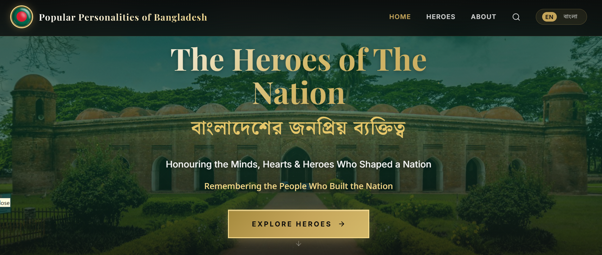

<p align="center">
  
</p>

<h1 align="center">🇧🇩 Popular Personalities of Bangladesh</h1>

<p align="center">
  <b>A living bilingual digital archive celebrating the heroes, thinkers, and legends who shaped Bangladesh 🇧🇩</b>
</p>

<p align="center">
  <a href="https://popularbangladeshi.vercel.app/"></a>
  <a href="https://popular-bangladeshi-personalities.vercel.app/"></a>
  
  
</p>

---

## ✨ About the Project

From the fertile banks of Bengal rise poets, scientists, artists, leaders, and athletes whose names echo around the world. **Popular Personalities of Bangladesh** is a living digital archive that traces the birthplaces, life stories, contributions, and legacies of the nation's most influential people — presented beautifully in **English and Bangla**.

Every profile follows a structured data model, ensuring consistency and completeness across all entries, and each portrait links to a **verified image source**.

### 🎯 Highlights

- **🕊️ 49+ curated personalities** across 7 categories
- **🗺️ Interactive birthplaces map** built on Leaflet + OpenStreetMap
- **🔍 Instant live search** with category filtering
- **🌐 Full English ↔ বাংলা language toggle** for every field
- **🏅 Structured profiles** — contributions, awards, major works, timelines, quotes, galleries & videos
- **⭐ Featured heroes** curated on the home page
- **⚡ Blazing-fast** React 19 + Vite frontend

## 🗂️ Categories

| Category | English | বাংলা |
|---|---|---|
| ⚛️ science | Science & Technology | বিজ্ঞান ও প্রযুক্তি |
| 📖 literature | Literature & Poetry | সাহিত্য ও কবিতা |
| 🎨 arts | Arts & Culture | শিল্প ও সংস্কৃতি |
| 🏛️ history | National History & Leadership | জাতীয় ইতিহাস ও নেতৃত্ব |
| 🩺 medicine | Medicine & Health | চিকিৎসা ও স্বাস্থ্য |
| 🏏 sports | Sports & Athletics | খেলাধুলা ও ক্রীড়া |
| 🎓 education | Education & Social Reform | শিক্ষা ও সমাজ সংস্কার |

---

## 🛠️ Tech Stack

| Layer | Technology |
|---|---|
| **Frontend** | React 19, Vite, React Router, Framer Motion, React-Leaflet, Lucide Icons |
| **Backend** | Node.js, Express 5 |
| **Database** | MongoDB Atlas (`popularpersons`) |
| **Deployment** | Vercel (frontend + backend) |

## 📁 Project Structure

```
bangladesh-national-icons/
├── frontend/                 # React + Vite single-page app
│   ├── src/
│   │   ├── pages/            # Home, Categories, Search, Profile, About
│   │   ├── components/       # Navbar, Footer, PersonCard, BangladeshMap…
│   │   ├── context/          # LanguageContext (en/bn)
│   │   ├── assets/           # districts data
│   │   └── api.js            # Central API helper (reads VITE_API_BASE_URL)
│   └── .env                  # VITE_API_BASE_URL
└── backend/                  # Express REST API
    ├── server.js             # Routes: personalities, categories, stats, map
    ├── db.js                 # MongoDB connection (URI fallback aware)
    └── .env                  # MongoDB URI, DB & collection names
```

## 🔌 API Endpoints

| Method | Endpoint | Description |
|---|---|---|
| `GET` | `/api/personalities` | All profiles (filter by `category`, `search`, `featured`, `limit`) |
| `GET` | `/api/personalities/:id` | Single profile with full bilingual data |
| `GET` | `/api/categories` | Categories with live counts |
| `GET` | `/api/stats` | Total / featured / category counts |
| `GET` | `/api/map` | Bangladesh GeoJSON for the interactive map |

---

## 🚀 Getting Started

### Prerequisites

- Node.js 18+
- A MongoDB Atlas cluster

### 1. Backend

```bash
cd backend
npm install
```

Create a `.env` file with your own credentials:

```env
MONGODB_URI=mongodb+srv://<user>:<password>@cluster0.xxxxx.mongodb.net/?appName=Cluster0
DB_NAME=popularpersons
COLLECTION_NAME=personalities
MAP_COLLECTION_NAME=bangladeshmap
```

Seed the database and start the server:

```bash
npm start   # → http://localhost:5000
```

### 2. Frontend

```bash
cd frontend
npm install
```

Point the app at your API:

```env
VITE_API_BASE_URL=http://localhost:5000   # or your deployed backend URL
```

Run it:

```bash
npm run dev    # → http://localhost:3000
```

Or create a production build:

```bash
npm run build  # → dist/
```

---

## ☁️ Deployment

- **Frontend** → `https://popularbangladeshi.vercel.app` (deploy the `frontend/` folder)
- **Backend** → `https://popular-bangladeshi-personalities.vercel.app` (deploy the `backend/` folder with serverless-friendly Express)

Set the matching environment variables in your hosting provider's dashboard.

---

## 📜 License

Distributed under the MIT License. Data and portraits remain property of their respective sources and are used for educational, non-commercial purposes.

<hr />

<p align="center">
  Made with ❤️ in Bangladesh 🇧🇩
</p>